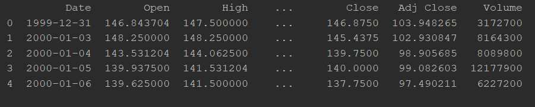
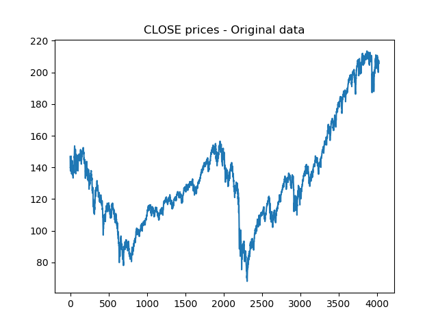
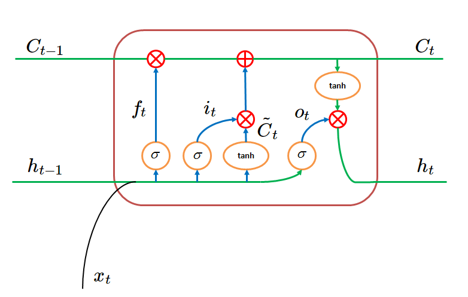
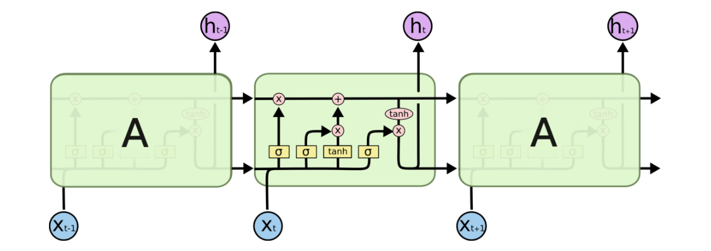
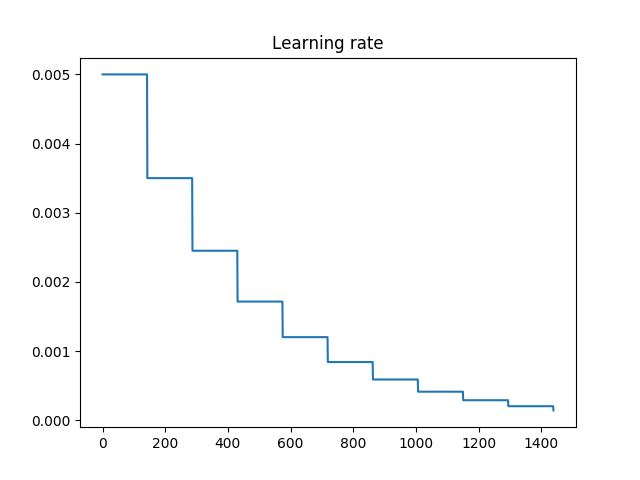

# Trading Stocks using LSTM
 This project is about predicting stock prices using LSTM neural network and implementing simple trading strategy.

## Introduction

 Developing trading strategy is quite challenging task because of variety of approaches that could be applied. Some of the mostly used are: momentum strategy, reversion strategy and forecasting strategy.
 For this assignment, I will use forecasting strategy combined with deep learning. The main idea is to predict the next value of a stock based on some historical factors (data). 

## Data

In this case, our historical data are prices of a SPY stock from 1st Jan 2010 to 31st Dec 2015. This data contains information for opening, closing, highest and lowest prices for each day, as presented on the Figure 1. In this project, only CLOSE prices were used for prediction and the graphic is showed on Figure 2. This data contains 4025 days for the given period.

 
  Figure 1: Data for period from 1st Jan 2010 to 31st Dec 2015

   

Figure 2: CLOSE prices data

This data should be preprocessed so to put it into the right range. Normalization is problem here because trading data tends to change its statistics (mean, variance) over time, so we can’t simply subtract the mean from this whole dataset and divide it by its variance. Instead, we split the data into adjacent windows of size input_length, and values in each window divide with the value of last sample in previous window. After this, we get normalized data as shown on the Figure 3. On this figure, normalized data is averaged across windows where input_length=3. From this original data 90% is train data and the rest 10% is validation data.

## Prediction with ML model
Before choosing the right machine learning model for prediction, I have read some articles so to get sense of what kind of model to use. After this short research, I decided to use LSTM recurrent neural network for prediction. This is one kind of recurrent neural networks which allows working with sequential data and gives quite good results when working with time-series signals. It overcomes some standard problems in vanilla recurrent networks such as vanishing/exploding gradients. This problem occurs when gradient increases to much or decreases to 0, so it can not propagate back through the network and update its parameters. On the other side, LSTM solves this problem with its unique architecture shown on the Figure 4. 

   

Figure 4: LSTM cell

It contains 4 gates (F – forget, I – input, C’ – cell, O - output) which decide how information is passed through the cell. A single LSTM has hidden state (h) and cell state (c). These states store all the logic and memory needed for prediction.
	Forget gate (F) decides what information will be thrown away from the cell state. Its equation is f_t=σ(W_f∙[h_(t-1),x_t ]+b_f) and depends on previous hidden state h_t and the current input x_t. When f_t is small (close to 0) it will keep this information, otherwise it will reject.
	Input gate (I) is given as i_t=σ(W_i∙[h_(t-1),x_t ]+b_i) and decides whether the input will be propagated through the cell and affect the cell hidden state.
	Cell gate (C’) is defined as C_t^'=tanh⁡(W_C∙[h_(t-1),x_t ]+b_C ) and this represents possible new cell values.
Using last two gates new cell state is specified as C_t=f_t∙C_(t-1)+i_t∙C_t^'
	Output gate (O) decides what is going to be on the output.  First, this gate is computed as O_t=σ(W_o∙[h_(t-1),x_t ]+b_o) and it decides how much of a cell state will affect the new hidden state. Therefore, new hidden state is calculated as h_t=O_t∙tanh⁡(C_t ).
In this implementation, 3 LSTM cells are stacked in a row and their hidden state size is specified with parameter lstm_size. This is shown on the Figure 5. 

   

Figure 5: Stacked LSTM cells

Each LSTM cell has dropout wrapper which prevents them from overfitting, as well as L2 regularization. After last cell, simple multiplication of its hidden layer and matrix W is used to give output with proper dimension. Loss is calculated as a mean squared error between targets and predicted values and during training both train and validation loss is observed so to stop before overfitting occurred. The original CLOSE values were split in training (90%) and validation (10%) dataset.
While tweaking the parameters these were changed: input_length ∈[1,3,5],lstm_size  ∈[50,250,400],num_epochs∈[10,30,50] . Parameter learning_rate has 5e-3 initial value and this is decayed by the factor 0.7 after every 2 epochs. Decreasing of learning_rate through epochs is shown on the Figure 6.

   

Figure 6: Learning rate

